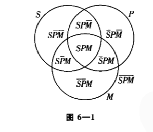

# 逻辑学导论

前注：A是全称肯定命题，E是全称否定命题，I是特称肯定命题，O是特称否定命题。

## 第二部分  演绎推理

### 直言命题

构成（components)

S: = 对象，

P: = 对象，

质: = 分为肯定、否定两种情况

换质: = 1.改变其质（如将命题最前面的“所有”换为“没有”），

​               2.并用谓项的补（若谓项表示为S，则谓项的补就是非S）替换谓项。

换位: = 交换主谓项位置

限制性换位: = 把全称改为特称命题。

换质位:

1.先换质

2.再换位

#### 结构

The basic structure of a 命题:

......

量项（主项）联项（谓项）

......

例子：

所有猴子是哺乳动物。

“所有”: = 量项

“猴子”: = 主项

"是": = 连项

"哺乳动物": = 谓项

#### 周延性

introduction:在研究完结构后，

​                          作为为判断三段论的有效性的前提知识，

​                          需判断主项、谓项在命题中是否周延。

 周延: = 一个命题中提及了某个对象的所有部分，

​               则称该对象在该命题中是周延的。

接上面例子:推理一: 所有猴子包括了猴子的所有部分，

​                                      故具有周延性。

​                       推理二: 所有猴子没有包括所有的哺乳动物，

​                                      故哺乳动物不具有周延性。

#### 传统对当方阵

introduction:接下来要

​                          1.研究（A、E、I、O）之间的关系。

​                          2.经历三种变换（即换质、换位、换质位）之后的命题与原命题的关系。

| A真——>E假，I真，O假     | E真——>A假，I假,O真     |
| ----------------------- | ---------------------- |
| I 真——>E假，A,O真假不定 | O真——>A假，E,I真假不定 |
| A假——>O真，E,I真假不定  | E假——>I真，A,O真假不定 |
| I假——>A假，E真，O真     | O假——>A真，E假，I真    |

上面的表格是古典逻辑下四个命题的真假性关系。

注：反对关系: = 两个命题不能同时为真，

​       下反对关系: = 两个命题不能同时为假。

​        矛盾关系:= 一个为真，另一个一定为假

​        等差关系:= 全称命题为真可推出对应同质特称命题为真

a/换位法      有效换位表

| 被换位命题  | 换位命题     |
| ----------- | ------------ |
| A: 所有S是P | I: 有P是S    |
| E: 没有S是P | E: 没有P是S  |
| I: 有S是P   | I: 有P是S    |
| 0: 有S不是P | （换位无效） |

b/换质法  有效换质表（被换质命题与换质命题在逻辑上等价）

| 被换质命题  | 换质命题      |
| ----------- | ------------- |
| A: 所有S是P | E: 没有S是非P |
| E: 没有S是P | A: 所有S是非P |
| I: 有S是P   | O: 有S不是非P |
| O：有S不是P | I：有S是非P   |

C/换质位法（换质位命题在逻辑上等价，除将E命题换质位在逻辑上不等价）

| 前提        | 完全换质位命题  |
| ----------- | --------------- |
| A：所有S是P | A：所有非P是非S |
| E：没有S是P | O：有非P是非S   |
| I：有S是P   | (换质位无效)    |
| O:有S不是P  | O: 有非P不是非S |

#### 存在问题

introduction：讨论古典逻辑存在的问题，即命题的主项或谓项是否需要真实存在。

​                       （算是对古典逻辑的bug的解决方案）

1.命题肯定某种对象存在: = 命题有存在含义

2.引入假设方案: 全面存在预设

​      引入假设的代价:  = 不能刻画否定有元素存在

   （如小胡子不是德国人这个命题）

#### 解决方法——布尔解释

introduction: 给出古典逻辑的现代解释，解决古典逻辑的bug。

解释原则：

1.I和O仍有存在含义，

若S不存在，

(1)“有S是P"FALSE,

(2)"有S不是P"FALSE

2.全称命题A、E与特称命题I、O之间矛盾关系依然成立

3.上述关系融贯（推不出矛盾），

​       全称命题无存在含义。

4.日常全称命题: =  ”有存在含义的特称命题“+“没有存在含义的全称命题”

如：如果有彩虹小马，那他们肯定会说话。

5.规定A、E可同真，不再是反对关系

6.若主项指称不存在，

​      I、O均为假

7.等差关系  不再是普遍有效

（意思是不是在所有情况下都成立）

8.直接推理中，A与O换质位，所有命题换质，E与I换位有效，

​      而限制换位，限制换质位无效。

9.方阵周边关系不再成立，对角线上矛盾关系保持不变。

注: 逻辑学家认为，存在谬误= 预设谬误

#### 符号表示

将先前讨论的命题用符号的方法表示

$$
A:S\overline{P}=0
$$

$$
E:SP=0
$$

$$
I:SP\neq0
$$

$$
O:S\overline{P}\neq0
$$

### 直言三段论

三段论的一种形式。

#### 标准式直言三段论

三段论构成: (component)

| 三段论: = 两个前提推出一个结论 | 直言三段论: = 1.三个直言命题（包含且仅包含三个词项） |
| ------------------------------ | ---------------------------------------------------- |
|                                | 2.每个词项在构成命题中恰好出现两次                   |
| 标准直言: = 前提，结论         | 标准直言形式:（A、E、I、O）                          |

标准式直言三段论构成：

A.大项、小项与中项

结论的谓项: = 大项，

结论的主项: = 小项，

结论中不出现，前提中出现两次: = 中项。

小项: = S    中项: = M   大项: = P

B.式

例子: EIO

 E属于大前提，

I属于小前提，

O属于结论

C.格

| M-P    | P-M    | M-P    | P-M    |
| ------ | ------ | ------ | ------ |
| S-M    | S-M    | M-S    | M-S    |
| S-P    | S-P    | S-P    | S-P    |
| 第一格 | 第二格 | 第三格 | 第四格 |

#### 韦恩图表示法

一种检验三段论是否有效的方法

检查规则：

1\先画出全称命题，

2\在有x表示特称命题，

若特称命题未明确要加到哪一块，则写在两部分交叉线上。

3\最后检查图示是否包含结论。

包含，正确。

反之，错误。

#### 直言三段论的规则

为了更加有效的判断直言三段论是否有效，需要用到以下规则。

规则1: 三段论只能包含三个项，

​           且每一项的意思不变  

规则2: 中项至少在一个前提中周延。

规则3: 结论中周延的项在前提中也要周延。

规则4: 避免出现两个否定前题

规则5: 如果有一个前提是否定的，

​             那么结论必须是否定的。

规则6: 两个全称命题得不出特称结论。

注: 存在谬误是命题的主项没有存在含义。

#### 直言三段论的15个有效形式

为了方便判断，以下总结了直言三段论的有效形式

### 日常生活中的语言论证

#### 日常语言中的论证

判断日常论证有效性的方法: 将日常语言中的论证翻译（或曰转化）为标准的直言三段论形式

日常论证的三种情况: 1.前提与结论未按直言三段论的顺序排列

​                                     2.命题数目在表面上超过了三项

​                                     3.构成命题不都是直言三段论命题

#### 如何将非标准三段论化为直言三段论

1.去除同义词

例: 没有富人是游民

​      所有律师都是有钱人

​      结论: 没有法律代理人是流浪者。

改为：没有富人是游民

​            所有的律师都是富人

​            结论: 没有律师是游民

2.去除补类

例子:  所有哺乳动物都是温血动物

​           没有蜥蜴是温血动物

​            结论: 所有蜥蜴是非哺乳动物

改为: 所有哺乳动物都是温血动物

​          没有蜥蜴是温血动物

​          结论: 没有蜥蜴是哺乳动物

或:      所有非温血动物都是非哺乳动物

​           所有蜥蜴是非温血动物

​            结论: 所有蜥蜴是非哺乳动物

#### 如何将直言命题标准化

1.单称命题: = 肯定或否定一个个体归属某个类别

若其中有存在含义，可直接化为全称命题

2.谓项为形容词类词汇或短语

可化为名词类词汇或短语

如: 美丽改为美丽的事物

3.主要动词不是标准联项“是”或“不是”、

例子: 所有人都寻求赞誉

改为: 所有人都是赞誉的寻求者

4.标准形式的成分都有，顺序不对

例子: “赛马全是良种马”

改为: “所有赛马是良种马”

5.量词非“所有”、“有”、“没有” 意思的直言命题

"每一": = "所有"

"a"或"an": = "所有"或"有"

"the": = 特定个体或全部元素

特例: "not every "与"no any"译法不明确

6.排斥命题，含"有"、"只有"

（1）一般情况下: = 所有

（2）特殊情况下: = 所有或有

7.不含量词的直言命题

例: 狗是肉食动物

改为: 所有狗是肉食动物

8.可转换为标准形式的直言命题

例: 有白色的大象

改为: 有大象是白色的事物

9.除外命题

例: 除了雇员都是合格的。

改:所有非雇员是合格者，且没有雇员是合格者。

#### 协同翻译

例:你总是与穷人为伍。

翻译: 所有时间都是你与穷人为伍的时间。

解释: 时间可视为参项

参项: = 一个用来维持标准形式的辅助词项

#### 省略三段论

省略三段论: = 一个不完整的推理，且有一部分需要读者领会

分类

1.第一类: 不出现大前提

2.第二类: 不出现小前提

3.第三类: 两个前提都出现，不保留结论

#### 连锁三段论

定义:= 只给出前提与最后结论

#### 两难推论

两难推论: = 需在两个令人不快的选项之间作选择

结论是析取命题: = 复杂式两难推论

结论是直言命题: = 简单式两难推论

解决方法:

1.绕开死角法

2.直击法

3.反两难推论

### 符号逻辑

#### 现代逻辑符号

核心: 逻辑连接词

焦点: 命题与论证的结构

#### 合取、否定和析取符号

简单陈述:= 不包含其他分支的陈述

复合陈述: = 包含另一个陈述作为分支

A.合取: = 两个陈述之间的使用的语词"and"

被如此联结的两个陈述: =  合取支

若p和q代表任意两个陈述
$$
p和q=p\centerdot q
$$
陈述有真值

真陈述真值= 真

假陈述真值= 假

合取= 真值函项复合陈述

合取支= 真值函项的分支

if 复合陈述所有分支= 真值函项的分支

​    则 复合陈述= 真值函项的复合陈述

​         简单陈述= 不是真值函项的复合陈述
$$
\centerdot 是真值联结词
$$
以下是合取运算的真值表

B.否定
$$
一个陈述的否定通常用“\sim”表示
$$

C.析取

析取命题: = 在两个陈述之间加上“或”实现

两个分支陈述= 析取支

特点: 至少有一个析取支为真
$$
p或q= p\bigvee q
$$

D.标点符号
$$
p\centerdot q\bigvee r容易混淆，应规范化为(p\centerdot q)\bigvee q或p\centerdot(q\bigvee r)
$$
例子：p和q不会都当选
$$
\sim(p\centerdot q)
$$
p和q都不会当选
$$
\sim(p)\centerdot\sim(q)
$$
规定:否定符号:施加于最小标点符号所管辖的有效陈述
$$
\sim p\bigvee q=(\sim p)\bigvee q
$$
例子: p,q中至少有一个是真的，但非两者都为真（不相容析取）
$$
(p\bigvee q)\centerdot\sim(p\centerdot q)
$$
真值计算法:从内到外

例

A\B都是真陈述，而X\Y是假陈述，则
$$
\sim[\sim(A\centerdot X)\centerdot (Y\bigvee\sim B)]的真值如下
,X为假,故A\centerdot X为假,从而否定式\sim(A\centerdot X)为真;
$$

$$
因为B为真,它的否定\sim B为假,又因为Y也为假，故Y和\sim B的析取Y\bigvee\sim B亦为假：
$$

$$
[\sim(A\centerdot X)\centerdot (Y\bigvee\sim B)]是一个真陈述与一个假陈述的和取，因此是假的;故它的否定即原陈述为真。\equiv^T\equiv
$$

不知道分支陈述的真和假也可以通过假设分支陈述的真和假，计算出复合函数的真值。

#### 条件陈述与实质蕴含

if "如果"放在第一个陈述前，

"那么"放在第一个陈述与第二个之间

则 该复合陈述=条件陈述

"如果"后面的分支陈述= 前件(蕴含者)

"那么"后面的分支陈述= 后件(被蕴含者)

如果前件为真，后件会为真。(反之亦然)

四个条件陈述的不同蕴含：

A.为逻辑推出

B.为术语定义

C.为逻辑推理

D.为个人决策
$$
如果p那么q为真，则\sim p\centerdot q 为假，\sim(\sim p\centerdot q)为真，故\sim(\sim p\centerdot q)可当做如果p那么q的一部分
$$

$$
"如果，那么"的共同含义为\sim(\sim p\centerdot q),可简写为p\supset q
$$

真值表

$$
可把"\subset"看成实质蕴含，不表明前后件之间的实在关联
$$
例子: 如果有一个好律师，他会被宣判为无罪

​          他有一个好律师蕴含他会宣判为无罪

​           
$$
可将上例写为 L\supset A
$$
"p是q的必要条件"与“p仅当q"可写为
$$
p\supset q
$$
“如果”与“不确定”没有必然的逻辑联系

#### 论证形式与论证

A. 运用逻辑类进行反驳

论证一:如果培根写了那些通常归于莎士比亚的剧本，那么培根是一位伟大的作家。

​             培根是一位伟大的作家

​             因此，培根写了那些通常归根于莎士比亚的作品

论证二：如果华盛顿是被暗杀的，那么华盛顿死了

​               华盛顿死了

​               那么，华盛顿是被暗杀的

论证一符号化
$$
B\supset G
$$

$$
G
$$

$$
\therefore B
$$

论证二符号化
$$
A\supset D
$$

$$
D
$$

$$
\therefore A
$$

陈述变元: =一个字母，具体陈述可以被带入的它或它所在的位置。

（可用p. q . s. r 等小写字母作为陈述变元）

论证形式:一系列包含陈述变元而不包含陈述符号的序列，

​                当用陈述带入陈述变元时（同一陈述带入同一陈述变元）

​                其结果就是一个论证

四个论证形式：

一个论证形式无效，当且仅当它至少有一个前提为真，且结论为假的带入例

一个论证形式有效，当且仅当它没有前提为真，且结论为假的带入例

B.用真值表检验论证

论证形式有效性
$$
p\subset q
$$

$$
q
$$

$$
\therefore p
$$

可得真值表

C.一些常见的有效论证形式

析取三段论
$$
p\bigvee q
$$

$$
\sim p
$$

$$
\therefore q
$$

肯定前件式
$$
p\supset q
$$

$$
p
$$

$$
\therefore q
$$

否定后件式
$$
p\supset q
$$

$$
\sim q
$$

$$
\therefore\sim p
$$

假言三段论

$$
p\supset q
$$

$$
q\supset r
$$

例子
$$
(p\supset q)\centerdot(r\supset s)
$$

$$
p\bigvee r
$$

$$
\therefore q\bigvee s
$$

这个论证检验需要四个初始栏，和16个真值表

D.一些常见的无效论证形式

肯定后件谬误
$$
p\supset q
$$

$$
q
$$

$$
\therefore p
$$

否定前件谬误
$$
p\supset q
$$

$$
\sim p
$$

$$
\therefore\sim q
$$

E.带入例与特征形式

必须注意论证的特征形式

#### 陈述形式与实质等值

A.陈述形式与陈述

陈述形式: = 含有陈述变元但不含陈述的符号形式

将陈述带入陈述形式= 一个陈述

具有某种形式的任一陈述 = 该陈述的带入例

B.重言的、矛盾的、偶真的陈述形式

重言式 = 只有真带入例的陈述形式 = 重言的陈述形式
$$
如要表明p\bigvee\sim q 是一个重言式，只需构造
$$

矛盾式 = 一个假带入的陈述形式 = 自相矛盾的陈述形式

偶真陈述形式 = 其带入例既有真陈述又有假陈述

C.实质等值

= 两个陈述同真假

形如
$$
A\equiv B 的陈述双条件陈述
$$
D. 论证、条件陈述与重言式
$$
一个论证形式有效\equiv 其条件陈述的表达形式是一个重言式
$$

#### 逻辑连词

逻辑等价: =真值相同，意义相等

与他们中某一个相结合与另一个相结合一样，

结合后两个陈述的实质等值陈述为重言式 = 两个陈述逻辑等价
$$
可表述为\equiv^T\equiv
$$
逻辑等价属于双条件陈述

$$
断言析取p\bigvee q否定逻辑的等价于断言p的否定和q的否定的合取
$$

$$
可构造双条件陈述\sim(p\bigvee q)\equiv (\sim p\centerdot\sim q)
$$

$$
\sim(p\bigvee q)\equiv^T\equiv (\sim p \centerdot \sim q)
$$
此为摩尔根定理：

(a)两个陈述析取的否定逻辑等价于这两个陈述的否定的和取

(b)两个陈述合取的否定逻辑等价于这两个陈述否定的析取
$$
实质蕴含定义:p\supset q的逻辑等价于(\sim p\bigvee q)
$$

$$
p\supset q \equiv^T \equiv(\sim p\bigvee q)
$$

#### 实质蕴含怪论

意义与实质蕴含不相干

#### 三大“思想法则”

同一

不矛盾

排中

### 演绎方法

#### 有效性的形式证明

如果安德逊被提名，那么她会去波士顿

如果她去波士顿，那么她会在那儿竞选

如果她在那而竞选，他会遇到道格拉斯

安德逊没有遇到道格拉斯

或者安德逊被提名，或者被某个更合适的人选中。

因此，某个更合适的人会被选中。
$$
A\supset B
$$

$$
B\supset C
$$

$$
C\supset D
$$

$$
\sim D
$$

$$
A\bigvee E
$$

$$
\therefore E
$$

例子:
$$
1.A\supset B
$$

$$
2.B\supset C
$$

$$
3.C\supset D
$$

$$
4.\sim D
$$

$$
5.A\bigvee E
$$

$$
\therefore E
$$

$$
6.A\supset C
$$

$$
7.A\supset D
$$

$$
8.\sim A
$$

$$
9.E
$$

1.2. H. S.; 6.3 H. S.;7.4 M. T.;5.8 D. S.

有效论证形式：是一个基本有效论证的带入例

推理规则

1.肯定前件式(M. P.)
$$
p\supset q
$$

$$
p
$$

$$
\therefore q
$$

2.否定后件式(M. T.)

$$
p\supset q
$$

$$
\sim q
$$

$$
\therefore\sim p
$$

3.假言三段论（H. S.)
$$
p\supset q
$$

$$
q\supset r
$$

$$
\therefore p\supset r
$$

4.析取三段论(D. S.)
$$
p\bigvee q
$$

$$
\sim p
$$

$$
\therefore q
$$

5.构造式两难(C. D)
$$
(p\supset q)\centerdot(r\supset s)
$$

$$
p\bigvee r
$$

$$
\therefore q\bigvee s
$$

6.吸收律(Abs.)
$$
p\supset q
$$

$$
\therefore p\supset(p\centerdot q)
$$

7.简化律(S imp .)
$$
p\supset q
$$

$$
\therefore p
$$

8.合取律(Conj.)
$$
p
$$

$$
q
$$

$$
\therefore p\centerdot q
$$

9.附加律(Add.)
$$
p
$$

$$
\therefore p\bigvee q
$$

#### 替换规则

下面任一逻辑等价的形式，在他们出现的任何地方，都可以相互替换

形式证明是一个"能行的"概念

"能行的":= 根据给定的推论规则表，在有限步骤内机械的判定给定陈述序列是否构成形式证明

前九条只能用在完整行上

后面可用在非完整行上

#### 无效性证明

对一个论证中的陈述变元进行真值指派，使其前提为真，结论为假，论证形式就是无效的。

例子
$$
F\supset R
$$

$$
S\supset R
$$

$$
\therefore F\supset S
$$

将"真"指派给F,R,"假"指派给S,该论证有真前提和假结论，它就被证明为无效。

证明方法：使前提为真或结论为假

#### 不相容性

怪异推论

如果飞机的引擎出现故障，它就降落在本德了。

如果飞机的引擎没有出故障，它就降落在克利夫兰了。

飞机没有降落在本德和克利夫兰。

因此，飞机必定降落在丹佛了。
$$
A\supset B
$$

$$
\sim\ A\supset C
$$

$$
\sim(B\bigvee C)
$$

$$
\therefore D
$$

前提互不相容，自相矛盾，故不存在前提为真，结论为假的情况

形式证明:

$$
1.A\supset B
$$

$$
2.\sim\ A\supset C
$$

$$
3.\sim(B\bigvee C)
$$

$$
\therefore D
$$

$$
4.\sim B\centerdot\sim C
$$

$$
5.\sim B
$$

$$
6.\sim A
$$

$$
7.C
$$

$$
8.\sim C\centerdot\sim B
$$

$$
9.\sim C
$$

$$
10.C\bigvee D
$$

$$
11.D
$$

3,De M.  4, Simp. 1,5 M. T.  2,6 M. P.  2,6 M. P.  4,Com. 8,Simp. 7,Add.   10,9, D. S.

前提不相容，则产生各种结论

example:

今天是星期天

今天不是星期天

因此，月亮是鲜奶酪做的

转化为符号形式
$$
1.S
$$

$$
2.\sim S
$$

$$
\therefore M
$$

$$
3.S\bigvee W
$$

$$
4.M
$$

1,Add 3,2,D. S.

### 量化理论

#### 单称命题

例子:

所有人都是有死的

苏格拉底是人

苏格拉底是有死的

符号化:
$$
A
$$

$$
H
$$

$$
\therefore M
$$

但这种论证形式无效，故需研究内在逻辑结构

单称命题: = 断言某个特定的个体具有某种特殊的属性

此例中，"苏格拉底"=  主项 ,"人"=谓项

解决方案: 令字母 "a"到"w"= 个体常元 ,大写字母= 符号化属性

单称命题可按Ha 这种格式表示，或H—

"—"表示右边有另一个符号即个体符号出现，有时可用x表示

单称命题可表示为 Hx[H(x)] ,其中，x是位置标示

Hx是命题函项，(1)含有个体变元

​                            (2)当一个个体常元带入个体变元时，变为陈述(有真带入例与假带入例)

Hx/Mx/Fx/Bx/Wx/这种类型的命题函项叫做"简单谓述"

有一些真带入例与假带入例的命题函项，带入例均是单称肯定命题

以下一个例子: H =人 M= 有死的 F= 胖的 W= 聪明的 B=漂亮的

#### 量化

通过概括与量化可像将个体常元带入个体变元一样得到命题

例:"所有事物都是有死的"/"有些事物是漂亮的"属于普遍命题，不指定任何个体

第一个例子可改为 给定不管任何事物，它都是有死的。

用关系变元改写   给定任何x, x是有死的。

再改为 给定任何x ,Mx

又，给定任何X可用"(x)"表示

故命题  (x)Mx

第二个例子 至少存在这样一个事物，它是漂亮的

可改为 至少存在一个x,这个x是漂亮的

可改为 至少存在一个x,Bx
$$
"至少存在一个x"用符号"\exists(x)"
$$

$$
命题可改为 \exists(x)Bx
$$

上述两个例子符号化后可称为量化式

命题可用列举，即个体常元带入个体变元

或概括，即前面放一个全称量词或存在量词

全称量化式为真，则存在量化式为真

例子: 没有任何事物是完美的

解释为 每个事物都是不完美的

改为 给定不管任何个体事物，它不是完美的。

改写成 给定任何x，x不是完美的

P= "是完美的"

则 命题 
$$
(x)\sim Px
$$
推论

1."每个事物是有死的''被有些是物是不能有死的"否定

下列双条件陈述必然真，逻辑真
$$
\sim(x)Mx\equiv^T\equiv (\exist x)\sim Mx
$$
2."每个事物都是有死的"正好表示了"不存在任何不是有死的事物"所表示的东西

用双条件陈述表示
$$
(x)Mx\equiv^T\equiv\sim (\exist x)\sim Mx
$$
3."没有任何事物是有死的"被"有些事物不是有死的"否定
$$
\sim(x)Mx\equiv^T\equiv(\exist x) Mx
$$
4."每个事物都不是有死的"正好表示了"不存在任何有死的事物"
$$
(x)\sim Mx\equiv^T\equiv\sim(\exist x) Mx
$$

$$
用"\phi"替代例式谓词"死的",\phi 代表任何一个简单谓词
$$

$$
[\sim(x)\phi x]\equiv^T\equiv [(\exist x)\sim\phi x]
$$

$$
[(x)\phi x]\equiv^T\equiv[\sim (\exist x)\sim\phi x]
$$

$$
[(x)\sim\phi x]\equiv^T\equiv[\sim (\exist x)\phi x]
$$

$$
[\exists(x)\sim\phi x]\equiv^T\equiv[\sim (x)\phi x]
$$

1.顶端命题是反对关系，可同时为假，不能同时为真

2.底端两个命题是下反对关系，可同时为真，但不能同时为假

3.对角线相反两端的命题是矛盾关系，它们中一个为真，则另一个一定为假。

4.在方阵的每侧，下面命题的真被它正上方命题的真所蕴含。

#### 传统主—谓命题

所有人都是有死的 [全称肯定:A]

所有人都不是有死的[全称否定:E]

有些人是有死的[特称肯定:I]

有些人不是有死的[特称否定:O]

注: A/I 来自拉丁文 affirmo;E/O来自拉丁文 nego

例子:

对A命题解释  给定不管任何事物，如果它是人，它是有死的

"它"变为x

则给定任何x，如果x是人，那么x是有死的。

改写成   
$$
给定任何x，x是人\supset x是有死的
$$
最后
$$
(x)(Hx\supset Mx)
$$

$$
Hx\supset Mx 的带入例有形如Ha\supset Ma/Hb\supset Mb/Hc\supset Mc/Hd\supset Md
$$

$$
Hx\centerdot Mx 的带入例有形如Ha\centerdot Ma/Hb\centerdot Mb/Hc\centerdot Mc/Hd\centerdot Md
$$

$$
Wx\bigvee Bx的带入例形如Wa\bigvee Ba/Wb\bigvee Bb
$$

任何相同主项的单称命题为分支陈述为真值的复合函项命题，

都可看作某些或所有真值函项的联结词加之谓词所构成的命题函项的带入例

E命题所有人不是有死的可写为
$$
(x)(Hx\supset\sim MX)
$$
I有些人是有死的可写为
$$
(\exists x)(Hx\centerdot MX)
$$
O有些人不是有死的可写为
$$
(\exists x)(Hx\centerdot\sim Mx)
$$

$$
若用\phi/\psi 表示任何一个谓词，传统模型四个主—谓命题可表示为如下方阵
$$

注意:I命题不能由A命题推出，O命题不能由E命题推出

A/E命题不断言假定任何事物存在，I/O命题却假定某物存在

如何处理否定符号

例子:
$$
\sim(\exist x)(Fx\centerdot\sim Gx)
$$
可变形为
$$
(x)\sim(Fx\centerdot\sim Gx)
$$
用摩尔根律可变成
$$
(x)(\sim Fx\bigvee\sim\sim Gx)
$$
用双重否定律
$$
(x)(\sim Fx\bigvee Gx)
$$
引入实质蕴含定义，改写为A命题
$$
(x)(Fx\supset Gx)
$$
我们把否定符号只作用于简单谓述的公式成为范形公式

#### 有效性证明

引例:"所有人都是有死的，苏格拉底是人，苏格拉底是有死的."
$$
(x)(Hx\supset Mx)
$$

$$
Hs
$$

$$
\therefore Ms
$$

$$
解析：第一个前提断定了Hx\supset Mx的全称量化式，若其为真，则其所有带入例为真，可推出带入例Hs\supset Ms
$$

$$
从它和第二个前提Hs,根据肯定前件式，得出结论Ms
$$

推论规则新增原则: 一个命题函项的任意带入例都可以有效的从全称量化形式推得

称为"全称列举原则"= "UI", 
$$
用希腊字母nu(\nu)表示任一个体符号，可得
$$

$$
UI: (x)(\phi x)
$$

$$
\therefore\phi\nu     (\nu 是任一个体符号)
$$

其有效形式证明可以写成
$$
1.(x)(Hx\supset Mx)
$$

$$
2.Hx
$$

$$
\therefore Ms
$$

$$
3.Hs\supset Ms
$$

$$
4.Ms
$$

1,UI       3,2 M. P.

引例: 所有人都是有死的。所有希腊人都是人，因此所有希腊人都是有死的。
$$
(x)(Hx\supset Mx)
$$

$$
(x)(Gx\supset Hx)
$$

$$
\therefore (x)(Gx\supset Mx)
$$

形式证明: 令"y"指称一任一选取的个体

$$
1.(x)(Hx\supset Mx)
$$

$$
2.(x)(Gx\supset Hx)
$$

$$
\therefore (x)(Gx\supset Mx)
$$

$$
3.Hy\supset My
$$

$$
4.Gy\supset Hy
$$

$$
5.Gy\supset My
$$

1,UI    2,UI  4,3 H. S.

添加原则: 从一个命题函项关于任意选取个体名称的带入例，我们可以有效推出命题函项的全称量化式

此为概括原则，缩写为 UG

被表述成:
$$
UG:\phi y (y指称"一任意选取的个体")
$$

$$
\therefore(x)(\phi x)
$$

故前面形式证明的最后一行
$$
6.(x)(Gx\supset Mx)
$$
5, UG

引例: 没有人是完美的。希腊人都是人。因此没有希腊人是完美的。

有效形式证明:
$$
1.(x)(Hx\supset\sim Px)
$$

$$
2.(x)(Gx\supset\ Hx)
$$

$$
\therefore(x)(Gx\supset\sim Px)
$$

$$
3.Hy\supset\sim Py
$$

$$
4. Gy\supset Hy
$$

$$
5.Gy\supset\sim Py
$$

$$
6.(x)(Gx\supset\sim Px)
$$

1,UI  2,UI  4,3  H. S.  5, UG \

引例: 所有罪犯都是邪恶的。有些人是罪犯。因此有些人是罪恶的。
$$
(x)(Cx\supset Vx)
$$

$$
(\exist x)(Hx\centerdot Cx)
$$

$$
\therefore(\exist x)(Hx\centerdot Vx)
$$

添加规则: 从一个命题函项的存在量化形式，

可推得关于在其语境中早先没有出现过的任一个体常元(除y以外)的带入例。

称为存在列举规则，"EI"
$$
EI:(\exist x)(\phi x)
$$

$$
\therefore\phi\nu[\nu 是任一在语境中先前没有出现过的个体常元(除y之外)]
$$

论证:

$$
1.(x)(Cx\supset Vx)
$$

$$
2.(\exist x)(Hx\centerdot Cx)
$$

$$
\therefore(\exist x)(Hx\centerdot Vx)
$$

$$
3.Ha\centerdot Ca
$$

$$
4.Ca\supset Va
$$

$$
5.Ca\centerdot Ha
$$

$$
6.Ca
$$

$$
7.Va
$$

$$
8.Ha
$$

$$
9. Ha\centerdot Va
$$

2,EI  1,UI  3,Com  5,Simp   4,6 M. P.   3,  Simp.  8,7 Conj.

增加规则:

从一个命题函项的任一为真的带入例，我们可以有效推出该命题函项的存在量化式

此为存在概括原则，称为"EG"
$$
EG: \phi\nu (\nu 是任一个体符号)
$$

$$
\therefore(\exist x)(\phi x)
$$

前面证明的第十行
$$
10.(\exist x)(Hx\centerdot Vx)
$$
9,  EG

#### 无效性证明

运用普遍命题与单称命题真值函项复合式的等价式

如果刚好存在一个个体，譬如a
$$
(x)(\phi x)\equiv^T\equiv\phi a\equiv^T\equiv(\exist x)(\phi x)
$$
如果刚好存在两个个体 a和b  
$$
(x)(\phi x)\equiv^T\equiv[\phi a\centerdot\phi b], 而(\exist x)(\phi x)   \equiv^T\equiv[\phi a\bigvee\phi b]
$$
存在三个个体 a\b\c
$$
(x)(\phi x)\equiv^T\equiv[\phi a\centerdot\phi b\centerdot\phi c], 而(\exist x)(\phi x)   \equiv^T\equiv[\phi a\bigvee\phi b\bigvee\phi c]
$$
存在n个个体 a\b......n
$$
(x)(\phi x)\equiv^T\equiv[\phi a\centerdot\phi b\centerdot\phi c...\phi n], 而(\exist x)(\phi x)   \equiv^T\equiv[\phi a\bigvee\phi b\bigvee\phi c...\bigvee\phi n]
$$
若前提为真而结论为假，涉及量词的论证无效

考察论证: 所有雇佣兵都是不可靠的。没有游击队员是雇佣兵。因此没有游击队员是不可靠的。
$$
(x)(Mx\supset Ux)
$$

$$
(x)(Gx\supset\sim Mx)
$$

$$
\therefore (x)(Gx\supset\sim Ux)
$$

将个体a带入
$$
Ga\supset\sim Ma
$$

$$
\therefore Ga\supset\sim Ua
$$

Ga/Ua指派为真，Ma指派为假证明论证无效

有些论证只对一个个体有效
$$
(\exist x)Fx
$$

$$
\therefore (x)Fx
$$

另一个例子 所有牧羊犬都是可爱的。所有牧羊犬都是看门狗。因此，所有看门狗都是可爱的。
$$
(x)(Cx\supset Ax)
$$

$$
(\exist x)(Cx\centerdot Wx)
$$

$$
\therefore(x)(Wx\supset Ax)
$$

对刚好只有一个个体模型的a
$$
Ca\supset Aa
$$

$$
Ca\centerdot Wa
$$

$$
\therefore Wa\supset Aa
$$

论证有效

对有两个个体a/b的模型
$$
(Ca\supset Aa)\centerdot(Cb\supset Ab)
$$

$$
(Ca\centerdot Wa)\bigvee(Cb\centerdot Wb)
$$

$$
\therefore (Wa\supset Aa)\centerdot (Wb\supset Ab)
$$

Ca/Aa/Wa/Wb指派为真，Cb/Ab 指派为假  论证无效
$$
在原论证含有全称量化命题(x)(\phi x),用"\centerdot"把\phi b与\phi a 结合起来
$$

$$
在原论证含有一个量化命题函项(\exist x)(\phi x),用"\bigvee"把\phi b与\phi a 结合起来
$$

如果对其简单分支陈述进行真值表指派可以证明其真值函项无效，证明原论证无效。

#### 非三段论推理

论证: 旅馆是既贵的又令人压抑的

​          有些旅馆简陋

​          因此，有些贵的东西简陋。

Hx= "x是旅馆"  Bx="x既贵又令人压抑"  Sx="x是简陋的"  Ex="x是贵的" 可用A/I 命题表达，可符号化为
$$
(x)(Hx\supset Bx)
$$

$$
(\exist x)(Hx.Sx)
$$

$$
\therefore (\exist x)(Ex\centerdot Sx)
$$

看上去似乎无效，但翻译为

(加上Dx="x是令人压抑的")
$$
1.(x)[Hx\supset (Ex\centerdot Dx)]
$$

$$
2.(\exist x)(Hx.Sx)
$$

$$
\therefore (\exist x)(Ex\centerdot Sx)
$$

$$
3.Hw\centerdot Sw
$$

$$
4.Hw\supset(Ew\centerdot Dw)
$$

$$
5.Hw
$$

$$
6.Ew\centerdot Dw
$$

$$
7.Ew
$$

$$
8.Sw\centerdot Hw
$$

$$
9.Sw
$$

$$
10.Ew\centerdot Sw
$$

$$
11.(\exist x)(Ex\centerdot Sx)
$$

2,EI   1,UI  3, Simp.    4,5 M. P.   6.Simp   3,Com  8,Simp.    7,9, Conj  10,EG

主意: 需理解自然语言以后将其符号化

例: 所有运动员力气大或跑得快
$$
(x)[Ax\supset(Sx\bigvee Qx)]
$$
而 或者所有运动员力气大或者所有运动员跑的快
$$
(x)(Ax\supset Sx)\bigvee(x)(Ax\supset Qx)
$$
牡蛎好吃和蚌好吃
$$
(x)[(Ox\bigvee Cx)\supset Dx]
$$
而不是
$$
(x)[(Ox\centerdot Cx)\supset Dx]
$$
除以前的获胜者在，都符合条件
$$
(x)(Px\supset\sim Ex)\centerdot (x)(\sim Px\supset Ex)
$$
再符号化
$$
(x)(Ex\equiv\sim Px)
$$
例子:

经理和主管或者是有能力的员工，或者是所有者的亲属。

敢抱怨的人必定或者是主管，或者是所有者的亲属。

唯有经理和工头是有能力的员工

某人敢抱怨

因此，某个主管是所有者的亲属
$$
(x)[(Mx\supset Sx)\supset(Cx\bigvee Rx)]
$$

$$
(x)[(Dx\supset (Sx\bigvee Rx)]
$$

$$
(x)(Mx\equiv Cx)
$$

$$
(\exist x)Dx
$$

$$
\therefore(\exist x)(Sx\centerdot Rx)
$$

描述只含个体a的可能域或模型，并对Ca/Da/Fa/Ra的指派值为真，Sa的指派值为假，我们可以证明它无效。

